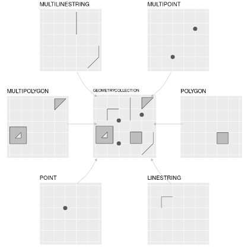

```{r setup, include=FALSE}
knitr::opts_chunk$set(echo = TRUE)
```


```{r include=FALSE}
library("sf")
library(xaringan)
library(spData)
library(ggplot2)
world <- world[, c(1, 11)]
```

# What is a Coordinate Reference System? (CRS)

- Let's start with the basics: A Coordinate System is a set of mathematical rules for specifying how coordinates are to be assigned to points


- CRS "defines <b>how the spatial elements of data relate to the surface of the Earth</b>".pull-left[.footnote[[*]Muenchow, Robin Lovelace, Jakub Nowosad, Jannes. Chapter 2 Geographic Data in R | Geocomputation with R. geocompr.robinlovelace.net, https://geocompr.robinlovelace.net/spatial-class.html]] (by a datum)
---

# Simplify the world

.center[
.center[Source: https://www.icsm.gov.au/sites/default/files/inline-images/spheroid_height_0.jpg]]
---
# One component of the CRS: the Datum

Contains information on what ellipsoid to use and the precise relationship between the Cartesian coordinates and the location on the Earth’s surface

- <b>geocentric datum</b>, not optimized for a specific location (WGS84)
- <b>local datum</b>, matches perfectly the surface at a particular location (NAD83)

.center[
.center[Source: https://www.icsm.gov.au/sites/default/files/inline-images/spheroid_height_0.jpg]]
---

# Definition: Projection

CRSs are either geographic or projected

- <b>Geographic CRS</b>, e.g. Ellipsoidal models are defined by two values: the equatorial radius and the polar radius (longitude and latitude) 
- All <b>projected CRSs</b> are based on a geographic CRS; transform 3D to 2D with Easting and Northing values

projecting is always distorted (impossible to have a perfect representation of area, direction, distance, and shape at the same time)
  
---

# projections

.center[
.center[Source:https://www.joaoleitao.com/wp-content/uploads/2019/04/world-map-projections-1024x903.jpg]]
---

# So, how can we work with CRS in R?

Spatial R packages support various CRSs

- describe CRSs in R with
  - Spatial Reference System Identifier (SRID), short and easy to remember (most popular: EPSG:4326 represents the latitude/longitude WGS84 CRS, and ESRI:54030 Robinson projection)
  - or with well-known text (WKT216) definitions (more detailed, and precise)
  
---

# What is Simple Features for R? (sf)

- sf is a package providing a class system for geographic vector data
- combines functionality of several previous packages (sp, rgdal and rgeos)
- basic building blocks of sf: different geometry types
- find more useful information about sf in its vignette (vignette("sf1")

---

# Most common geometry types

.center[
.center[Source:https://bookdown.org/robinlovelace/geocompr/figures/sf-classes.png]]

---

# sf in practice
- sf objects are stored in dataframes, the geographical data can be found in the ‘geom’ coloumn (contains coordinates of the country polygons)
- all geometries in a geometry list-column must have the same CRS

---

# Look at this example from the world dataset in sf:
```{r sf, echo=TRUE}
head(world)
```
---

# simple plot of spatial data
```{r echo=TRUE}

plot(st_geometry(world), col = sf.colors(12, categorical = TRUE), border = 'grey', 
     axes = TRUE)

```

---
# sf and its useful functions

```{r echo=TRUE}
st_crs(world) # get CRS
```

---
# sf and its useful functions
```{r}
st_crs(world)$IsGeographic # check if its geographic or projected
```
---
# sf and its useful functions

```{r}
st_crs(world)$units_gdal #find out the CRS units
```
---
# sf and its useful functions
```{r echo=TRUE}
st_crs(world)$srid # get the SRID
```
---
# sf and its useful functions
```{r echo=TRUE}
st_crs(world)$proj4string # get the proj4string
```
---
# sf and its useful functions
Remember, all geometries in a geometry list-column must have the same CRS! We can transform it easily with sf!
The input can be either a SRID ("EPSG:4269" in the example), complete WKT2 representation (proj4string) or CRS (WGS 84)

```{r echo=TRUE}
world2 = data.frame(world) %>% 
   st_as_sf(crs = 4269)

st_crs(world2)
```

---
# Sources

Content and code of this workshop draw heavily on the following two, very interesting ebooks: 
- Muenchow, Robin Lovelace, Jakub Nowosad, Jannes. Geocomputation with R. bookdown.org, https://geocompr.robinlovelace.net/
- Bivand, Edzer Pebesma, Roger. | Spatial Data Science. keen-swartz-3146c4.netlify.app, https://keen-swartz-3146c4.netlify.app/intro.html. 

Other sources we used for the presentation:

- Bivand, Edzer Pebesma, Roger. Spatial Data Science. keen-swartz-3146c4.netlify.app, https://keen-swartz-3146c4.netlify.app/
- Overview of Coordinate Reference Systems (CRS) in R: https://www.nceas.ucsb.edu/sites/default/files/2020-04/OverviewCoordinateReferenceSystems.pdf

---
#AND NOW...


<b>Enjoy the life part of our workshop guided by Marco!


Thanks for your attention so far, we are happy to answer your questions!</b>
